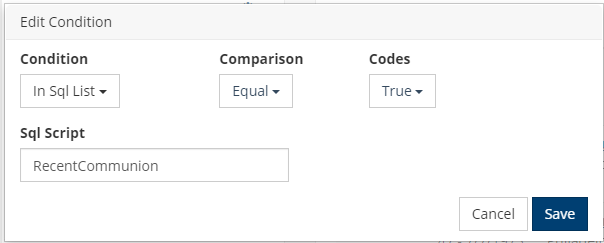

# Recent Communion

This is a simple script we use for tracking who has attended worship services where communion has been served, as part 
of a Status Flag.

Add a Meeting Extra Value called "communion" to each meeting where Communion is served, and add an "In Sql List" Condition to your search.

